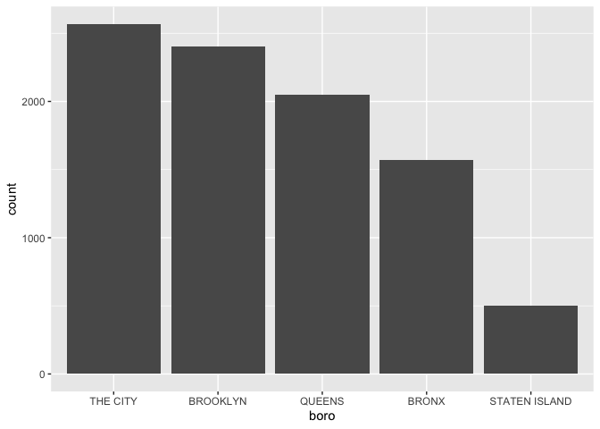

Strings and Factors
================

``` r
#一般画图的操作：预先设定好自己喜欢的theme和color
library(tidyverse)

knitr::opts_chunk$set(
  fig.width = 6,
  fig.asp = .6,
  out.width = "90%"
)

theme_set(theme_minimal()+theme(legend.position = "bottom"))

options(
  ggplot2.continuous.colour = "viridis",
  ggplot2.continuous.fill = "viridis")

scale_colour_discrete = scale_colour_viridis_d
scale_fill_discrete = scale_fill_viridis_d
```

``` r
library(rvest)
library(p8105.datasets)
library(tidyverse)
```

    ## ── Attaching core tidyverse packages ──────────────────────── tidyverse 2.0.0 ──
    ## ✔ dplyr     1.1.4     ✔ readr     2.1.5
    ## ✔ forcats   1.0.0     ✔ stringr   1.5.1
    ## ✔ ggplot2   3.5.1     ✔ tibble    3.2.1
    ## ✔ lubridate 1.9.3     ✔ tidyr     1.3.1
    ## ✔ purrr     1.0.2     
    ## ── Conflicts ────────────────────────────────────────── tidyverse_conflicts() ──
    ## ✖ dplyr::filter()         masks stats::filter()
    ## ✖ readr::guess_encoding() masks rvest::guess_encoding()
    ## ✖ dplyr::lag()            masks stats::lag()
    ## ℹ Use the conflicted package (<http://conflicted.r-lib.org/>) to force all conflicts to become errors

## Strings

``` r
string_vec = c("my", "name", "is", "jeff")

str_detect(string_vec,"jeff")
```

    ## [1] FALSE FALSE FALSE  TRUE

``` r
str_replace(string_vec, "jeff", "Jeff")
```

    ## [1] "my"   "name" "is"   "Jeff"

``` r
str_replace(string_vec, "e", "E")
```

    ## [1] "my"   "namE" "is"   "jEff"

``` r
string_vec = c(
  "i think we all rule for participating",
  "i think i have been caught",
  "i think this will be quite fun actually",
  "it will be fun, i think"
  )

#beginning of a line
str_detect(string_vec, "^i think")
```

    ## [1]  TRUE  TRUE  TRUE FALSE

``` r
#end of a line
str_detect(string_vec, "i think$")
```

    ## [1] FALSE FALSE FALSE  TRUE

``` r
string_vec = c(
  "Time for a Pumpkin Spice Latte!",
  "went to the #pumpkinpatch last weekend",
  "Pumpkin Pie is obviously the best pie",
  "SMASHING PUMPKINS -- LIVE IN CONCERT!!"
  )

str_detect(string_vec, "pumpkin")
```

    ## [1] FALSE  TRUE FALSE FALSE

``` r
str_detect(string_vec, "Pumpkin")
```

    ## [1]  TRUE FALSE  TRUE FALSE

``` r
str_detect(string_vec, "PUMPKIN")
```

    ## [1] FALSE FALSE FALSE  TRUE

``` r
## multiple choice(中括号内部表示出现a/b都可以)
str_detect(string_vec, "[Pp]umpkin")
```

    ## [1]  TRUE  TRUE  TRUE FALSE

``` r
string_vec = c(
  '7th inning stretch',
  '1st half soon to begin. Texas won the toss.',
  'she is 5 feet 4 inches tall',
  '3AM - cant sleep :('
  )

str_detect(string_vec, "[0-9][a-zA-Z]")
```

    ## [1]  TRUE  TRUE FALSE  TRUE

a little weirder

``` r
string_vec = c(
  'Its 7:11 in the evening',
  'want to go to 7-11?',
  'my flight is AA711',
  'NetBios: scanning ip 203.167.114.66'
  )

# .表示匹配一切
str_detect(string_vec, "7.11")
```

    ## [1]  TRUE  TRUE FALSE  TRUE

How things start to get real strange

``` r
string_vec = c(
  'The CI is [2, 5]',
  ':-]',
  ':-[',
  'I found the answer on pages [6-7]'
  )

# Some characters are “special”. These include [ and ], ( and ), and .. If you want to search for these, you have to indicate they’re special using \. Unfortunately, \ is also special, so things get weird.
str_detect(string_vec, "\\[")
```

    ## [1]  TRUE FALSE  TRUE  TRUE

## Factors

``` r
vec_sex = factor(c("male", "male", "female", "female"))
vec_sex
```

    ## [1] male   male   female female
    ## Levels: female male

``` r
as.numeric(vec_sex)
```

    ## [1] 2 2 1 1

do some releveling

``` r
#把male放在前面，转换成数字时male就变成了1
vec_sex = fct_relevel(vec_sex, "male")
vec_sex
```

    ## [1] male   male   female female
    ## Levels: male female

``` r
as.numeric(vec_sex)
```

    ## [1] 1 1 2 2

## Revisit some examples in the past

### NSDUH

``` r
nsduh_url = "http://samhda.s3-us-gov-west-1.amazonaws.com/s3fs-public/field-uploads/2k15StateFiles/NSDUHsaeShortTermCHG2015.htm"

drug_use_html = read_html(nsduh_url)

marj_use_df = 
  drug_use_html |>
  html_table() |>
  first() |>
  slice(-1)
```

``` r
data_marj = 
  marj_use_df |>
  select(-contains("P Value")) |>
  pivot_longer(
    cols = -State,
    names_to = "age_year",
    values_to = "percent"
  ) |>
  separate(age_year, into = c("age", "year"), sep = "\\(") |>
  mutate(
    year = str_replace(year, "\\)", ""),
    percent = str_remove(percent, "[a-c]$"),
    percent = as.numeric(percent)
  )
```

``` r
data_marj |>
  filter(age == "12-17") |>
  ##把 state按照percent重新排序，才会获得从小到大的
  mutate(State = fct_reorder(State, percent)) |>
  ggplot(aes(x = State, y = percent, color = year)) +
  geom_point() + 
    theme(axis.text.x = element_text(angle = 90, hjust = 1))
```

<!-- -->

### One more example NYC restaurant Inspections

``` r
data("rest_inspec")

rest_inspec |> 
  group_by(boro, grade) |> 
  summarize(n = n()) |> 
  pivot_wider(names_from = grade, values_from = n)
```

    ## `summarise()` has grouped output by 'boro'. You can override using the
    ## `.groups` argument.

    ## # A tibble: 6 × 8
    ## # Groups:   boro [6]
    ##   boro              A     B     C `Not Yet Graded`     P     Z  `NA`
    ##   <chr>         <int> <int> <int>            <int> <int> <int> <int>
    ## 1 BRONX         13688  2801   701              200   163   351 16833
    ## 2 BROOKLYN      37449  6651  1684              702   416   977 51930
    ## 3 MANHATTAN     61608 10532  2689              765   508  1237 80615
    ## 4 Missing           4    NA    NA               NA    NA    NA    13
    ## 5 QUEENS        35952  6492  1593              604   331   913 45816
    ## 6 STATEN ISLAND  5215   933   207               85    47   149  6730

``` r
rest_inspec = rest_inspec |> 
  filter(str_detect(grade, "[A-Z]"),
         !(boro == "Missing"))

rest_inspec |> 
  filter(str_detect(dba, "[Pp][Ii][Zz][Zz][Aa]")) |>
  mutate(boro = str_replace(boro, "MANHATTAN", "THE CITY"),
    boro = fct_infreq(boro)) |>
  ggplot(aes(x = boro)) +
  geom_bar()
```

<!-- -->

One last thing about factors

``` r
rest_inspec |>
  filter(str_detect(dba, "[Pp][Ii][Zz][Zz][Aa]")) |>
  mutate(boro = fct_infreq(boro)) |>
  lm(zipcode ~ boro, data = _)
```

    ## 
    ## Call:
    ## lm(formula = zipcode ~ boro, data = mutate(filter(rest_inspec, 
    ##     str_detect(dba, "[Pp][Ii][Zz][Zz][Aa]")), boro = fct_infreq(boro)))
    ## 
    ## Coefficients:
    ##       (Intercept)       boroBROOKLYN         boroQUEENS          boroBRONX  
    ##           10025.2             1194.2             1313.8              440.7  
    ## boroSTATEN ISLAND  
    ##             282.2
